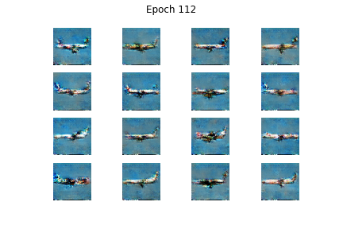

## Plane GAN

GAN to generate images of planes. Trained on dataset of about 10,000 images of planes. Training was done on a 1650 Super GPU and took about 1.5 hours to run 128 epochs.

### Sample outputs

### Training

### Model structure
See the Juypter notebook for more details about network structure and for loss/accuracy plots.